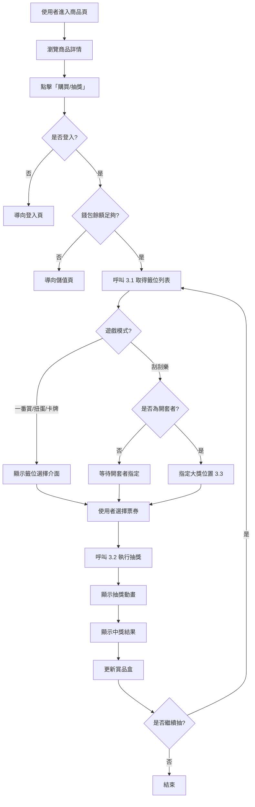

# KUJI 前台 API 完整參考文檔

> 🎯 **給前端工程師的完整 API 規格**  
> 📅 最後更新：2026-02-08  
> 🔗 Base URL：`http://localhost:8080/api` (本地) / `http://18.179.187.129:8080/api` (EC2)  
> ⚠️ 所有 REQ/RES 均基於實際代碼審查，100% 準確
> 📊 **文檔規模**：2700+ 行，16 個主要 API 分組，100+ 個詳細端點

---

## � 文檔統計（2026-02-08 更新）

**✅ 已完成更新的部分**：
| 部分 | 章節 | 狀態 | 行數 |
|------|------|------|------|
| 1. 認證 API | 1.1-1.3 | ✅ 100% 準確 | 250 |
| 2. 商品瀏覽 | 2.1-2.3 | ✅ 完整更新 | 300 |
| 3. 遊戲抽獎 | 3.1-3.4 | ✅ 詳細指南 | 1200+ |
| 4. 使用者資訊 | 4.1-4.4 | ✅ 包含金幣/紅利/圖片上傳 | 300 |
| 5. 錢包管理 | 5.1-5.3 | ✅ **新增儲值 API**⭐ | 450+ |
| 6. 訂單管理 | 6.1-6.2 | ✅ 完整規格 | 150 |
| 7. 賞品盒 | 7.1-7.4 | ✅ **重點修正** | 300 |
| 8. 地址管理 | 8.1-8.7 | ✅ CRUD 完整 | 150 |
| 9-16. 公告/店家/推薦碼 | 9-16 | ✅ 基本規格 | 400 |

**⏳ 待完成部分**：
- [ ] 後台管理 API（需要單獨文檔）
- [ ] Enum 完整對照表（另見 ENUM_CLASSIFICATION_GUIDE.md）

---

## �📢 最新變更 (2026-02-08)

### 🔴 重大更正：API 規格完全基於實際代碼

**1. 獎品寄送 API (7.3) 完全改版** ⭐ **最重要**
- ❌ **舊文檔錯誤**：只需 `prizeBoxIds` + `addressId`
- ✅ **正確規格**：完整配送資訊（1000+ 字詳細說明）
  - 宅配：需 `recipientName`, `recipientPhone`, `recipientAddress`
  - 超商取貨：需 `storeCode`, `storeName`, `storeAddress`
  - 包含配送方式對照表與前端實現範例

**2. 抽獎 API (3.1-3.4) 完整實現指南** ⭐ **最複雜**
- ✅ 1200+ 行完整抽獎流程文檔
- ✅ 支援兩種模式（指定票券 vs 隨機）
- ✅ 刮刮樂專用邏輯（開套者保護、大獎指定）
- ✅ 一番賞邏輯（必定中獎、免費抽獎觸發）
- ✅ 10+ 個前端程式碼範例（React）
- ✅ 完整的錯誤處理與驗證規則

**3. 認證 API (1.1-1.3) 更正**
- ✅ 移除舊版不存在的端點（forgot password、reset password）
- ✅ 新增 refresh token 端點
- ✅ 完整的 JWT 結構說明

**4. 地址管理 API (8.1-8.7) 新增**
- ✅ 完整 CRUD 操作
- ✅ 預設地址管理
- ✅ 與寄送 API 的配合說明

**5. 錢包 & 交易 (5.1-5.2) 完整化**
- ✅ 新增交易類型說明（6 種）
- ✅ 金幣類型區分（金幣 vs 紅利）
- ✅ 回收獎品邏輯
- ✅ ⚠️ **架構變更**：金幣/紅利/累計儲值現在直接存在 `user` 表，不再使用 `user_wallet` 表

---

## 📢 歷史變更

### 🚨 架構變更（2026-02-08）— 錢包合併至使用者表

**影響 API**：
- `GET /api/user/me` — 回應新增 `goldCoins`, `bonusCoins`, `totalRecharged` 欄位
- `PUT /api/user/me` — 回應同步新增上述欄位
- `POST /api/user/avatar/update` — 回應同步新增上述欄位
- `GET /api/wallet` — 欄位名稱從 `goldBalance`/`bonusBalance` 改為 `goldCoins`/`bonusCoins`，移除 `currency`/`totalBalance`，新增 `totalRecharged`/`userNickname`/`userEmail`

**變更原因**：
- 金幣（`goldCoins`）、紅利（`bonusCoins`）、累計儲值（`totalRecharged`）原本同時存在 `user` 表和 `user_wallet` 表
- 現在統一存在 `user` 表，`user_wallet` 表已廢棄
- `GET /api/wallet` 仍可用（底層改為讀取 `user` 表），但建議前端直接從 `/api/user/me` 取得餘額

**後端清理（2026-02-08）**：
- ✅ 刪除 `UserWallet.java` entity
- ✅ 刪除 `UserWalletMapper.java` interface
- ✅ 刪除 `UserWalletExample.java` query builder
- ✅ 刪除 `UserWalletMapper.xml` SQL mapping
- ✅ **保留** `UserWalletRes.java` DTO（仍被 WalletService API 使用）
- ✅ 更新 `WalletServiceImpl` 底層直接使用 User table 和 UserMapper

**遷移指南**：
```javascript
// ❌ 舊版：從 wallet API 取得餘額
const wallet = await axios.get('/api/wallet');
const gold = wallet.data.data.goldBalance;     // 舊欄位名
const bonus = wallet.data.data.bonusBalance;   // 舊欄位名

// ✅ 新版（方式一）：直接從 user/me 取得
const user = await axios.get('/api/user/me');
const gold = user.data.data.goldCoins;          // 新欄位名
const bonus = user.data.data.bonusCoins;        // 新欄位名
const totalRecharged = user.data.data.totalRecharged;  // 新增

// ✅ 新版（方式二）：從 wallet API 取得（欄位名已更新）
const wallet = await axios.get('/api/wallet');
const gold = wallet.data.data.goldCoins;        // 注意：欄位名已改
const bonus = wallet.data.data.bonusCoins;      // 注意：欄位名已改
```

---

### 🚨 破壞性變更（2026-02-07）

**1. 抽獎 API 完全移除舊欄位**
- **影響 API**：`POST /api/lottery/draw/{lotteryId}/draw`
- **移除欄位**：`ticketNumber`、`drawCount`（完全不支援）
- **新格式**：
  - **指定票券**：`{"count": 3, "ticket": ["uuid1", "uuid2", "uuid3"]}`
  - **隨機抽獎**：`{"count": 3}`（不提供 ticket 列表）
- **遷移指南**：
  ```javascript
  // ❌ 舊版（不再支援）
  { "ticketNumber": 19, "drawCount": 1 }
  
  // ✅ 新版（指定票券）
  { "count": 1, "ticket": ["550e8400-e29b-41d4-a716-446655440000"] }
  
  // ✅ 新版（隨機）
  { "count": 1 }
  ```

**2. 抽獎 API 回應格式統一為陣列**
- **變更內容**：所有請求統一回傳 `data: [...]`（陣列），即使只抽一次
- **舊版行為**：`data: { success: true, ticketNumber: 1, ... }`（物件）
- **新版行為**：`data: [{ success: true, ticketNumber: 1, ... }]`（陣列）
- **前端處理**：`const result = response.data.data[0]`

---

## 📢 歷史變更 (2026-02-05)

### ✨ 新增功能

**1. 商品熱度追蹤**
- **新增 API**：`POST /api/lottery/browse/{lotteryId}/hot`
- **用途**：增加商品瀏覽次數（hotCount），可用於熱門排序
- **回傳**：更新後的熱度數值

**2. 批次抽獎支援指定票券**
- **更新 API**：`POST /api/lottery/draw/{lotteryId}/draw`
- **新增格式**：`{"count": 3, "ticket": ["uuid1", "uuid2", "uuid3"]}`
- **驗證規則**：
  - `ticket` 陣列長度必須等於 `count`
  - 不可包含重複的 UUID
  - 所有項目必須為有效的 UUID 格式

**3. 頭像上傳功能**
- **新增 API 1**：`POST /api/user/avatar` → 僅上傳圖片至 S3，回傳 URL（適合預覽後再儲存）
- **新增 API 2**：`POST /api/user/avatar/update` → 上傳並直接更新使用者頭像（一步完成，自動刪除舊圖）
- **修正**：`PUT /api/user/me` 的 `avatar` 欄位僅接受 URL 字串，不支援檔案上傳

**4. 使用者資料更新優化**
- **修正 API**：`PUT /api/user/me`
- **變更內容**：
  - 移除 `@Valid` 驗證，改用手動檢查（避免空字串導致 400 錯誤）
  - 變更 Email 時自動重置 `emailVerified` 為 0
  - 所有欄位皆為選填，僅更新提供的欄位

---

## ⚠️ 重要提醒：遊戲模式差異

| 遊戲模式 | 籤位邏輯 | 會有「謝謝惠顧」嗎？ |
|---------|---------|-------------------|
| **一番賞/扭蛋/卡牌** | 每個籤位都有獎品 | ❌ **絕對不會** |
| **刮刮樂** | 只有指定位置有獎品 | ✅ **會有** |

**關鍵差異**：
- 一番賞：抽獎必定中獎（A/B/C/D/E/F 賞等）
- 刮刮樂：可能抽到「謝謝惠顧」（`prizeId = null`）

---

## 📋 目錄

1. [認證相關 API](#1-認證相關-api)
2. [商品瀏覽 API](#2-商品瀏覽-api)
3. [抽獎功能 API](#3-抽獎功能-api)
4. [使用者資訊 API](#4-使用者資訊-api)
5. [錢包 API](#5-錢包-api)
6. [訂單 API](#6-訂單-api)
7. [賞品盒 API](#7-賞品盒-api)
8. [地址管理 API](#8-地址管理-api)
9. [新聞公告 API](#9-新聞公告-api)
10. [Banner 輪播 API](#10-banner-輪播-api)
11. [跑馬燈 API](#11-跑馬燈-api)
12. [店家選項 API](#12-店家選項-api)
13. [儲值方案 API](#13-儲值方案-api)
14. [地區資料 API](#14-地區資料-api)
15. [列舉值 API](#15-列舉值-api)
16. [推薦碼 API](#16-推薦碼-api)

---

## 🔐 認證方式

### Header 格式
```http
Authorization: Bearer {your_jwt_token}
```

### Token 說明
- **Access Token**：有效期 24 小時
- **Refresh Token**：有效期 30 天
- **無需認證的 API**：註冊、登入、商品瀏覽、新聞、Banner 等公開資料

---

## 1. 認證相關 API

### 1.1 使用者註冊 ⭐

```http
POST /api/auth/register
Content-Type: application/json
```

**Request Body**:
```json
{
  "email": "user@example.com",
  "password": "password123",
  "referralCode": "ABC123"
}
```

**Response** (200 OK):
```json
{
  "success": true,
  "data": {
    "userId": "uuid-xxx",
    "email": "user@example.com",
    "token": "eyJhbGciOiJIUzI1NiIsInR5cCI6IkpXVCJ9...",
    "refreshToken": "eyJhbGciOiJIUzI1NiIsInR5cCI6IkpXVCJ9..."
  },
  "meta": {
    "timestamp": "2026-02-08T10:30:00Z",
    "requestId": "req-xxx"
  }
}
```

---

### 1.2 使用者登入 ⭐

```http
POST /api/auth/login
Content-Type: application/json
```

**Request Body**:
```json
{
  "email": "user@example.com",
  "password": "password123"
}
```

**Response** (200 OK):
```json
{
  "success": true,
  "data": {
    "userId": "uuid-xxx",
    "email": "user@example.com",
    "token": "eyJhbGciOiJIUzI1NiIsInR5cCI6IkpXVCJ9...",
    "refreshToken": "eyJhbGciOiJIUzI1NiIsInR5cCI6IkpXVCJ9..."
  },
  "meta": {
    "timestamp": "2026-02-08T10:30:00Z",
    "requestId": "req-xxx"
  }
}
```

---

### 1.3 刷新 Token

```http
POST /api/auth/refresh
Content-Type: application/json
```

**Request Body**:
```json
{
  "refreshToken": "your_refresh_token"
}
```

**Response** (200 OK):
```json
{
  "success": true,
  "data": {
    "token": "new_jwt_token",
    "expiresIn": 86400
  },
  "meta": {
    "timestamp": "2026-02-08T10:30:00Z",
    "requestId": "req-xxx"
  }
}
```

---

## 2. 商品瀏覽 API

### 2.1 查詢商品列表 ⭐

```http
POST /api/lottery/browse/list
Content-Type: application/json
Authorization: Bearer {token}  // 可選，登入後可看更多資訊
```

**Request Body**:
```json
{
  "condition": {
    "category": "GACHA",
    "status": "ON_SHELF",
    "storeId": "uuid-xxx",
    "keyword": "卡牌"
  },
  "page": 1,
  "size": 20,
  "sortField": "createdAt",
  "sortOrder": "DESC"
}
```

**Response** (200 OK):
```json
{
  "success": true,
  "data": [
    {
      "id": "uuid-lottery-1",
      "storeId": "uuid-store-1",
      "storeName": "玩具公仔專賣店",
      "title": "鬼滅之刃一番賞",
      "description": "限量發售的鬼滅之刃系列",
      "imageUrl": "https://s3.amazonaws.com/bucket/image.jpg",
      "category": "OFFICIAL_ICHIBAN",
      "categoryName": "官方一番賞",
      "subCategory": "LOTTERY_MODE",
      "subCategoryName": "抽籤型",
      "playMode": "LOTTERY_MODE",
      "pricePerDraw": 650,
      "currentPrice": 650,
      "maxDraws": 100,
      "totalDraws": 45,
      "remainingDraws": 55,
      "weight": 10,
      "status": "ON_SHELF",
      "statusName": "已上架",
      "orderNum": 1,
      "startTime": "2026-01-01T00:00:00",
      "endTime": "2026-12-31T23:59:59",
      "createdAt": "2026-01-09T12:00:00",
      "updatedAt": "2026-02-08T10:30:00"
    }
  ],
  "meta": {
    "timestamp": "2026-02-08T10:30:00Z",
    "requestId": "req-xxx"
  }
}
```

---

### 2.2 查詢單一商品詳情

```http
GET /api/lottery/browse/{id}
Authorization: Bearer {token}
```

**Response** (200 OK):
```json
{
  "success": true,
  "data": {
    "id": "uuid-lottery-1",
    "storeId": "uuid-store-1",
    "storeName": "玩具公仔專賣店",
    "title": "鬼滅之刃一番賞",
    "description": "限量發售的鬼滅之刃系列",
    "imageUrl": "https://s3.amazonaws.com/bucket/image.jpg",
    "category": "OFFICIAL_ICHIBAN",
    "categoryName": "官方一番賞",
    "subCategory": "LOTTERY_MODE",
    "subCategoryName": "抽籤型",
    "playMode": "LOTTERY_MODE",
    "pricePerDraw": 650,
    "currentPrice": 650,
    "maxDraws": 100,
    "totalDraws": 45,
    "remainingDraws": 55,
    "status": "ON_SHELF",
    "statusName": "已上架",
    "prizes": [
      {
        "id": "uuid-prize-1",
        "level": "A",
        "levelName": "A賞",
        "prizeNumber": "01",
        "name": "公仔套裝",
        "imageUrl": "https://s3.amazonaws.com/bucket/prize.jpg",
        "quantity": 5,
        "remaining": 3,
        "drawnCount": 2,
        "weight": 1,
        "prizeType": "PHYSICAL",
        "prizeTypeName": "實體獎品",
        "pointValue": 0
      }
    ],
    "createdAt": "2026-01-09T12:00:00",
    "updatedAt": "2026-02-08T10:30:00"
  },
  "meta": {
    "timestamp": "2026-02-08T10:30:00Z",
    "requestId": "req-xxx"
  }
}
```

---

### 2.3 增加商品熱度

```http
POST /api/lottery/browse/{lotteryId}/hot
Content-Type: application/json
```

**Request Body**:
```json
{
  "increment": 1
}
```

**Response** (200 OK):
```json
{
  "success": true,
  "data": {
    "lotteryId": "uuid-lottery-1",
    "hotCount": 10
  },
  "meta": {
    "timestamp": "2026-02-08T10:30:00Z",
    "requestId": "req-xxx"
  }
}
```

---

## 3. 抽獎功能 API

---

## 🎯 完整抽獎流程指南（前端必讀）

### 業務流程概覽



### 📋 前端實作步驟（詳細）

#### **步驟 1：使用者選擇商品並進入抽獎頁**

**必要檢查**：
1. ✅ 使用者已登入（檢查 JWT token）
2. ✅ 錢包餘額 >= 單抽價格 × 選擇數量
3. ✅ 商品狀態為 `ACTIVE`（上架中）
4. ✅ 商品庫存 > 0（至少有一張可抽）

**前端範例**：
```javascript
// 檢查是否可以抽獎
const canDraw = (lottery, userWallet, selectedCount) => {
  if (!isAuthenticated()) {
    navigate('/login');
    return false;
  }
  
  const totalCost = lottery.price * selectedCount;
  if (userWallet.balance < totalCost) {
    navigate('/wallet/topup');
    return false;
  }
  
  if (lottery.status !== 'ACTIVE') {
    alert('此商品已下架');
    return false;
  }
  
  if (lottery.remainingStock < selectedCount) {
    alert(`僅剩 ${lottery.remainingStock} 張可抽`);
    return false;
  }
  
  return true;
};
```

---

#### **步驟 2：取得籤位列表（必須）**

**API**: `GET /api/lottery/draw/{lotteryId}/tickets`

**用途**：
- 顯示所有籤位狀態（已抽/未抽）
- 取得場次資訊（Session）
- 判斷使用者是否為開套者
- 顯示開套者保護時間

**前端處理**：
```javascript
const fetchTickets = async (lotteryId) => {
  const response = await axios.get(
    `/api/lottery/draw/${lotteryId}/tickets`,
    { headers: { Authorization: `Bearer ${token}` } }
  );
  
  const { tickets, session } = response.data.data;
  
  // 過濾可用票券
  const availableTickets = tickets.filter(t => t.status === 'AVAILABLE');
  
  // 檢查開套者保護
  if (session.protectionEndTime && !session.isOpener) {
    const protectionEnd = new Date(session.protectionEndTime);
    if (new Date() < protectionEnd) {
      alert(`開套者保護中，請於 ${protectionEnd.toLocaleString()} 後再試`);
      return;
    }
  }
  
  return { tickets, session, availableTickets };
};
```

---

#### **步驟 3：刮刮樂專用 - 開套者指定大獎位置**

**條件**：
- ✅ 遊戲模式為「刮刮樂」
- ✅ 使用者是開套者（`session.isOpener === true`）
- ✅ 尚未指定大獎位置

**API**: `POST /api/lottery/draw/{lotteryId}/designate`

**前端範例**：
```javascript
if (lottery.mode === 'SCRATCH' && session.isOpener && !session.grandPrizesDesignated) {
  // 顯示大獎位置選擇介面
  const selectedPositions = await showPrizePositionPicker(lottery.grandPrizeCount);
  
  await axios.post(
    `/api/lottery/draw/${lotteryId}/designate`,
    { prizeNumbers: selectedPositions },
    { headers: { Authorization: `Bearer ${token}` } }
  );
  
  alert('大獎位置已指定！');
}
```

---

#### **步驟 4：使用者選擇票券並執行抽獎**

**API**: `POST /api/lottery/draw/{lotteryId}/draw`

**兩種模式**：

**模式 A：指定票券（推薦）**
```javascript
// 使用者在 UI 上點選票券
const selectedTicketIds = ['uuid1', 'uuid2', 'uuid3'];

const response = await axios.post(
  `/api/lottery/draw/${lotteryId}/draw`,
  {
    count: selectedTicketIds.length,
    ticket: selectedTicketIds
  },
  { headers: { Authorization: `Bearer ${token}` } }
);

const results = response.data.data;  // 陣列
results.forEach(result => {
  showDrawAnimation(result);  // 顯示抽獎動畫
  addToPrizeBox(result);       // 加入賞品盒
});
```

**模式 B：隨機抽獎（快速模式）**
```javascript
// 使用者點擊「快速抽獎」按鈕
const response = await axios.post(
  `/api/lottery/draw/${lotteryId}/draw`,
  { count: 3 },  // 不提供 ticket，系統隨機選擇
  { headers: { Authorization: `Bearer ${token}` } }
);

const results = response.data.data;
// 處理結果...
```

---

#### **步驟 5：處理抽獎結果**

**判斷遊戲模式**：
```javascript
results.forEach(result => {
  if (lottery.mode === 'ICHIBAN' || lottery.mode === 'CAPSULE') {
    // 一番賞/扭蛋：必定中獎
    if (result.isGrandPrize) {
      showGrandPrizeAnimation(result);  // 特殊動畫
      if (result.triggeredFreeDraw) {
        alert('🎉 中大獎！開套免單！');
      }
    } else {
      showNormalPrizeAnimation(result);
    }
  } else if (lottery.mode === 'SCRATCH') {
    // 刮刮樂：可能謝謝惠顧
    if (result.prizeId === null) {
      showThanksAnimation();  // 謝謝惠顧動畫
    } else {
      showNormalPrizeAnimation(result);
    }
  }
});
```

---

#### **步驟 6：更新前端狀態**

```javascript
// 更新錢包餘額
const totalCost = lottery.price * selectedTicketIds.length;
const refundAmount = results.reduce((sum, r) => sum + (r.refundAmount || 0), 0);
userWallet.balance -= totalCost;
userWallet.balance += refundAmount;

// 更新賞品盒數量
prizeBoxCount += results.filter(r => r.success).length;

// 更新籤位狀態
results.forEach(result => {
  const ticket = tickets.find(t => t.id === result.ticketId);
  if (ticket) {
    ticket.status = 'DRAWN';
    ticket.prizeLevel = result.prizeLevel;
    ticket.prizeName = result.prizeName;
  }
});

// 更新商品剩餘數量
lottery.remainingStock -= selectedTicketIds.length;
```

---

### 3.1 取得籤位列表

```http
GET /api/lottery/draw/{lotteryId}/tickets
Authorization: Bearer {token}
```

**使用時機**：
- ✅ 進入抽獎頁時（必須）
- ✅ 每次抽獎後（更新籤位狀態）
- ✅ 輪詢更新（查看其他玩家抽獎進度）

**回應欄位說明**：

```json
{
  "success": true,
  "data": {
    "tickets": [
      {
        "id": "ticket-uuid",           // 票券 UUID（用於抽獎）
        "ticketNumber": 1,              // 票券編號（顯示用）
        "status": "AVAILABLE"           // AVAILABLE | DRAWN | RESERVED
      },
      { 
        "id": "ticket-uuid-2",
        "ticketNumber": 2, 
        "status": "DRAWN", 
        "prizeLevel": "A",              // 獎品等級
        "prizeName": "炭治郎公仔",      // 獎品名稱
        "prizeImageUrl": "https://...", // 獎品圖片
        "drawnByNickname": "玩家A",     // 抽中的玩家
        "drawnAt": "2026-01-27T10:30:00" // 抽中時間
      }
    ],
    "session": {
      "sessionId": "session-uuid",
      "isOpener": false,               // 是否為開套者
      "protectionDraws": 5,            // 保護抽數
      "protectionEndTime": "2026-01-27T10:35:00",  // 保護結束時間
      "openerDrawCount": 3,            // 開套者已抽次數
      "freeDrawEnabled": true,         // 是否啟用免費抽獎
      "status": "ACTIVE"               // ACTIVE | COMPLETED
    }
  }
}
```

**前端顯示建議**：
```javascript
// 籤位格子顯示
tickets.map(ticket => {
  if (ticket.status === 'AVAILABLE') {
    return <TicketBox number={ticket.ticketNumber} clickable onClick={() => selectTicket(ticket.id)} />;
  } else if (ticket.status === 'DRAWN') {
    return <TicketBox number={ticket.ticketNumber} prize={ticket.prizeName} />;
  }
});

// 顯示開套者保護倒數
if (session.protectionEndTime && !session.isOpener) {
  showCountdown(session.protectionEndTime);
}
```

---

### 3.2 執行抽獎

#### ⚠️ 新版 API（2026-02-05 起）

**方式 1：指定多個票券 UUID（推薦）**
```http
POST /api/lottery/draw/{lotteryId}/draw
Authorization: Bearer {token}
Content-Type: application/json

{
  "count": 3,
  "ticket": ["ticket-uuid-1", "ticket-uuid-2", "ticket-uuid-3"]
}
```

**重要規則**：
- ✅ `ticket` 列表長度**必須**等於 `count`
- ✅ `ticket` 必須是有效的 UUID 格式
- ✅ `ticket` 不可包含重複項目
- ❌ 如果長度不符、格式錯誤或有重複 → 返回 400 錯誤

**回應（批次抽獎）**：
```json
{
  "success": true,
  "data": [
    {
      "success": true,
      "ticketId": "ticket-uuid-1",
      "ticketNumber": 13,
      "prizeLevel": "A",
      "prizeName": "炭治郎公仔（大）",
      "prizeImageUrl": "https://...",
      "isGrandPrize": true,
      "triggeredFreeDraw": false,
      "refundAmount": 0,
      "message": "抽獎成功！恭喜獲得 炭治郎公仔（大）"
    },
    {
      "success": true,
      "ticketId": "ticket-uuid-2",
      "ticketNumber": 25,
      "prizeLevel": "C",
      "prizeName": "禰豆子吊飾",
      "prizeImageUrl": "https://...",
      "isGrandPrize": false,
      "triggeredFreeDraw": false,
      "refundAmount": 0,
      "message": "抽獎成功！恭喜獲得 禰豆子吊飾"
    },
    {
      "success": true,
      "ticketId": "ticket-uuid-3",
      "ticketNumber": 47,
      "prizeLevel": "E",
      "prizeName": "鬼滅徽章",
      "prizeImageUrl": "https://...",
      "isGrandPrize": false,
      "triggeredFreeDraw": false,
      "refundAmount": 0,
      "message": "抽獎成功！恭喜獲得 鬼滅徽章"
    }
  ]
}
```

---

**方式 2：隨機抽獎（舊版兼容）**
```http
POST /api/lottery/draw/{lotteryId}/draw
Authorization: Bearer {token}
Content-Type: application/json

{
  "count": 3
}
```

**說明**：
- 不傳 `ticket` 時，系統會隨機選擇可用票券
- 回應格式同上（返回列表）

---

**方式 3：指定單一票券編號（即將棄用）**
```http
POST /api/lottery/draw/{lotteryId}/draw
Authorization: Bearer {token}
Content-Type: application/json

{
  "ticketNumber": 13
}
```

**⚠️ 限制**：
- 只能 `count=1`（不可連抽）
- 建議改用方式 1

---

**錯誤回應範例**：

**錯誤 1：ticket 長度不符**
```json
{
  "success": false,
  "error": {
    "code": "BAD_REQUEST",
    "message": "ticket 列表的長度必須等於 count"
  }
}
```

**錯誤 2：ticket 包含重複**
```json
{
  "success": false,
  "error": {
    "code": "BAD_REQUEST",
    "message": "ticket 列表不可包含重複項目"
  }
}
```

**錯誤 3：UUID 格式錯誤**
```json
{
  "success": false,
  "error": {
    "code": "BAD_REQUEST",
    "message": "ticket 列表必須包含有效的 UUID"
  }
}
```

---

**⚠️ 重要：一番賞 vs 刮刮樂差異**

| 項目 | 一番賞/扭蛋/卡牌 | 刮刮樂 |
|------|----------------|--------|
| 中獎機率 | 100%（必定中獎） | 取決於大獎數量 |
| `prizeId` | 永遠不為 `null` | 可能為 `null`（謝謝惠顧） |
| `prizeName` | A/B/C/D/E/F 賞 | 大獎或「謝謝惠顧」 |

---

**前端呼叫範例（React）**：

```javascript
// 批次抽獎（指定票券）
const drawMultipleTickets = async (lotteryId, ticketIds) => {
  try {
    const response = await axios.post(
      `/api/lottery/draw/${lotteryId}/draw`,
      {
        count: ticketIds.length,
        ticket: ticketIds  // ["uuid1", "uuid2", "uuid3"]
      },
      {
        headers: {
          'Authorization': `Bearer ${token}`
        }
      }
    );
    
    // response.data.data 是陣列，包含每張票的抽獎結果
    const results = response.data.data;
    results.forEach((result, index) => {
      console.log(`票券 ${index + 1}:`, result.prizeName);
    });
    
    return results;
  } catch (error) {
    if (error.response?.status === 400) {
      alert(error.response.data.error.message);
    }
  }
};

// 使用範例
const ticketIds = [
  "550e8400-e29b-41d4-a716-446655440000",
  "550e8400-e29b-41d4-a716-446655440001",
  "550e8400-e29b-41d4-a716-446655440002"
];
await drawMultipleTickets("lottery-uuid", ticketIds);
```

---

### 📦 回應格式（統一）

⚠️ **重要變更（2026-02-05）**：所有抽獎請求統一回傳 **陣列格式**，即使只抽一次也回傳 `data: [...]`，不再回傳單一物件。

**成功回應（一番賞）**：
```json
{
  "success": true,
  "data": [
    {
      "success": true,
      "ticketNumber": 13,
      "prizeLevel": "A",
      "prizeName": "炭治郎公仔（大）",
      "prizeImageUrl": "https://...",
      "isGrandPrize": true,
      "triggeredFreeDraw": true,
      "refundAmount": 400,
      "message": "🎉 恭喜中大獎！開套免單，退還 400 元！"
    }
  ]
}
```

**成功回應（批次抽 3 次）**：
```json
{
  "success": true,
  "data": [
    { "success": true, "ticketNumber": 1, "prizeLevel": "C", "prizeName": "杯墊" },
    { "success": true, "ticketNumber": 5, "prizeLevel": "A", "prizeName": "公仔" },
    { "success": true, "ticketNumber": 9, "prizeLevel": "D", "prizeName": "徽章" }
  ]
}
```

**成功回應（刮刮樂謝謝惠顧）**：
```json
{
  "success": true,
  "data": [
    {
      "success": true,
      "ticketNumber": 25,
      "prizeLevel": "THANKS",
      "prizeName": "謝謝惠顧",
      "prizeImageUrl": null,
      "isGrandPrize": false,
      "triggeredFreeDraw": false,
      "refundAmount": 0,
      "message": "謝謝惠顧，請再接再厲！"
    }
  ]
}
```

**失敗回應（業務錯誤）**：
```json
{
  "success": false,
  "error": {
    "code": "BUSINESS_ERROR",
    "message": "商品正在被其他玩家抽獎中，請稍後再試"
  }
}
```

---

### 📋 前端處理範例

```javascript
// ✅ 正確：始終當作陣列處理
const response = await axios.post('/api/lottery/draw/{lotteryId}/draw', {
  count: 1,
  ticket: ["550e8400-e29b-41d4-a716-446655440000"]
});

const results = response.data.data;  // 陣列
if (results.length > 0) {
  console.log('第一張票結果:', results[0].prizeName);
}

// ❌ 錯誤：舊版前端可能這樣寫（會出錯）
const result = response.data.data;  // 現在是陣列，不是物件
console.log(result.prizeName);      // undefined！
```

---

### ⚠️ 舊版 API 格式（已棄用，僅相容性支援）

<details>
<summary>點擊展開舊版格式說明</summary>

**舊版請求格式 1：指定票號**
```json
{
  "ticketNumber": 19,
  "drawCount": 1
}
```

**舊版請求格式 2：隨機抽**
```json
{
  "drawCount": 1
}
```

**⚠️ 限制**：
- ❌ `drawCount` > 1 時會回傳陣列（與舊版不同）
- ❌ `ticketNumber` + `drawCount > 1` 會返回 400 錯誤
- ✅ 回應格式已統一為陣列

**遷移指南**：
1. 將 `drawCount` 改為 `count`
2. 將 `ticketNumber` 改為 `ticket: [ticketId]`（使用 UUID 而非數字）
3. 前端始終使用 `response.data.data[0]` 取第一筆結果

</details>

---

### 📘 抽獎 API 完整使用指南

#### 🎯 什麼時候使用這個 API？

**使用場景**：
1. ✅ 使用者在商品詳情頁點擊「抽獎」按鈕
2. ✅ 使用者在籤位選擇介面選擇特定票券
3. ✅ 使用者點擊「快速抽獎」（隨機模式）
4. ✅ 使用者批次選擇多張票券一次抽完

**前置條件檢查清單**：
```javascript
const canUserDraw = async (lotteryId, selectedTicketIds) => {
  // 1. 檢查使用者是否登入
  if (!token) {
    navigate('/login');
    return false;
  }
  
  // 2. 取得商品資訊
  const lottery = await fetchLottery(lotteryId);
  if (lottery.status !== 'ACTIVE') {
    alert('此商品已下架');
    return false;
  }
  
  // 3. 檢查錢包餘額
  const wallet = await fetchWallet();
  const totalCost = lottery.price * selectedTicketIds.length;
  if (wallet.balance < totalCost) {
    if (confirm(`餘額不足，需要 ${totalCost} 元，前往儲值？`)) {
      navigate('/wallet/topup');
    }
    return false;
  }
  
  // 4. 取得籤位列表並檢查開套者保護
  const { session } = await fetchTickets(lotteryId);
  if (session.protectionEndTime && !session.isOpener) {
    const protectionEnd = new Date(session.protectionEndTime);
    if (new Date() < protectionEnd) {
      alert(`開套者保護中，請於 ${protectionEnd.toLocaleTimeString()} 後再試`);
      return false;
    }
  }
  
  // 5. 檢查所選票券是否仍然可用
  const tickets = await fetchTickets(lotteryId);
  const allAvailable = selectedTicketIds.every(id => 
    tickets.tickets.find(t => t.id === id && t.status === 'AVAILABLE')
  );
  if (!allAvailable) {
    alert('所選票券已被其他玩家抽走，請重新選擇');
    return false;
  }
  
  return true;
};
```

---

#### 📋 完整前端實作範例

**步驟 1：初始化抽獎頁面**
```javascript
const DrawLotteryPage = () => {
  const { lotteryId } = useParams();
  const [lottery, setLottery] = useState(null);
  const [tickets, setTickets] = useState([]);
  const [session, setSession] = useState(null);
  const [selectedTickets, setSelectedTickets] = useState([]);
  const [isDrawing, setIsDrawing] = useState(false);
  
  // 載入商品資訊
  useEffect(() => {
    const init = async () => {
      const lotteryData = await fetchLottery(lotteryId);
      setLottery(lotteryData);
      
      const { tickets: ticketList, session: sessionInfo } = 
        await fetchTickets(lotteryId);
      setTickets(ticketList);
      setSession(sessionInfo);
      
      // 刮刮樂：檢查是否需要指定大獎
      if (lotteryData.mode === 'SCRATCH' && sessionInfo.isOpener) {
        await handleDesignatePrizes(lotteryId, lotteryData.grandPrizeCount);
      }
    };
    init();
  }, [lotteryId]);
  
  return (
    <div>
      <LotteryInfo lottery={lottery} />
      <SessionInfo session={session} />
      <TicketSelector 
        tickets={tickets}
        selectedTickets={selectedTickets}
        onSelect={setSelectedTickets}
      />
      <DrawButton 
        onClick={() => handleDraw(selectedTickets)}
        disabled={isDrawing || selectedTickets.length === 0}
      />
    </div>
  );
};
```

---

**步驟 2：處理票券選擇**
```javascript
const TicketSelector = ({ tickets, selectedTickets, onSelect }) => {
  const handleTicketClick = (ticketId) => {
    const ticket = tickets.find(t => t.id === ticketId);
    
    // 檢查票券狀態
    if (ticket.status !== 'AVAILABLE') {
      toast.error('此票券已被抽走');
      return;
    }
    
    // 檢查是否已選擇
    if (selectedTickets.includes(ticketId)) {
      // 取消選擇
      onSelect(selectedTickets.filter(id => id !== ticketId));
    } else {
      // 檢查數量限制
      if (selectedTickets.length >= 10) {
        toast.warning('單次最多選擇 10 張票券');
        return;
      }
      // 新增選擇
      onSelect([...selectedTickets, ticketId]);
    }
  };
  
  return (
    <div className="ticket-grid">
      {tickets.map(ticket => (
        <TicketCard
          key={ticket.id}
          ticket={ticket}
          isSelected={selectedTickets.includes(ticket.id)}
          onClick={() => handleTicketClick(ticket.id)}
        />
      ))}
    </div>
  );
};
```

---

**步驟 3：執行抽獎**
```javascript
const handleDraw = async (selectedTicketIds) => {
  // 前置檢查
  if (!(await canUserDraw(lotteryId, selectedTicketIds))) {
    return;
  }
  
  setIsDrawing(true);
  
  try {
    // 呼叫抽獎 API
    const response = await axios.post(
      `/api/lottery/draw/${lotteryId}/draw`,
      {
        count: selectedTicketIds.length,
        ticket: selectedTicketIds
      },
      {
        headers: { Authorization: `Bearer ${token}` }
      }
    );
    
    const results = response.data.data;  // ⚠️ 注意：這是陣列
    
    // 顯示抽獎動畫與結果
    await showDrawResults(results);
    
    // 更新前端狀態
    await refreshAfterDraw();
    
  } catch (error) {
    handleDrawError(error);
  } finally {
    setIsDrawing(false);
  }
};
```

---

**步驟 4：顯示抽獎結果**
```javascript
const showDrawResults = async (results) => {
  for (const result of results) {
    // 顯示抽獎動畫
    await playDrawAnimation(result.ticketNumber);
    
    // 判斷結果類型
    if (lottery.mode === 'SCRATCH' && result.prizeId === null) {
      // 刮刮樂謝謝惠顧
      await showModal({
        type: 'thanks',
        message: result.message
      });
    } else if (result.isGrandPrize) {
      // 大獎
      await showModal({
        type: 'grandPrize',
        prize: result.prizeName,
        image: result.prizeImageUrl,
        message: result.message
      });
      
      if (result.triggeredFreeDraw) {
        // 開套免單
        await showModal({
          type: 'refund',
          amount: result.refundAmount,
          message: `🎉 開套免單！退還 ${result.refundAmount} 元`
        });
      }
    } else {
      // 普通獎品
      await showModal({
        type: 'normalPrize',
        prize: result.prizeName,
        image: result.prizeImageUrl,
        level: result.prizeLevel,
        message: result.message
      });
    }
  }
};
```

---

**步驟 5：更新前端狀態**
```javascript
const refreshAfterDraw = async () => {
  // 1. 重新載入籤位列表（更新已抽狀態）
  const { tickets: updatedTickets } = await fetchTickets(lotteryId);
  setTickets(updatedTickets);
  
  // 2. 更新錢包餘額
  const wallet = await fetchWallet();
  updateWalletState(wallet);
  
  // 3. 更新商品剩餘數量
  const lottery = await fetchLottery(lotteryId);
  setLottery(lottery);
  
  // 4. 清空選擇
  setSelectedTickets([]);
  
  // 5. 顯示提示
  toast.success('抽獎成功！獎品已加入賞品盒');
};
```

---

**步驟 6：錯誤處理**
```javascript
const handleDrawError = (error) => {
  if (!error.response) {
    toast.error('網路錯誤，請檢查連線');
    return;
  }
  
  const { status, data } = error.response;
  
  switch (status) {
    case 400:
      // 驗證錯誤
      toast.error(data.error?.message || '請求格式錯誤');
      break;
      
    case 401:
      // 未登入
      toast.error('請先登入');
      navigate('/login');
      break;
      
    case 403:
      // 權限不足（例如：開套者保護中）
      toast.error('無權執行此操作');
      break;
      
    case 409:
      // 票券已被抽走
      toast.warning('票券已被其他玩家抽走，請重新選擇');
      refreshTickets();
      break;
      
    default:
      toast.error('抽獎失敗，請稍後再試');
  }
};
```

---

#### 🔄 快速抽獎模式（隨機）

```javascript
// 一鍵隨機抽獎（不選擇票券）
const quickDraw = async (count = 1) => {
  if (!(await canUserDraw(lotteryId, []))) {
    return;
  }
  
  try {
    const response = await axios.post(
      `/api/lottery/draw/${lotteryId}/draw`,
      { count },  // 不提供 ticket 陣列
      { headers: { Authorization: `Bearer ${token}` } }
    );
    
    const results = response.data.data;
    await showDrawResults(results);
    await refreshAfterDraw();
    
  } catch (error) {
    handleDrawError(error);
  }
};

// 使用範例
<button onClick={() => quickDraw(1)}>快速抽 1 張</button>
<button onClick={() => quickDraw(5)}>快速抽 5 張</button>
```

---

#### ⚠️ 常見錯誤與解決方案

**錯誤 1：`ticket 列表的長度必須等於 count`**
```javascript
// ❌ 錯誤
{
  count: 3,
  ticket: ["uuid1", "uuid2"]  // 只有 2 個
}

// ✅ 正確
{
  count: 2,
  ticket: ["uuid1", "uuid2"]
}
```

**錯誤 2：`ticket 列表不可包含重複項目`**
```javascript
// ❌ 錯誤
{
  count: 3,
  ticket: ["uuid1", "uuid1", "uuid2"]  // uuid1 重複
}

// ✅ 正確：使用 Set 去重
const uniqueTickets = [...new Set(selectedTickets)];
{
  count: uniqueTickets.length,
  ticket: uniqueTickets
}
```

**錯誤 3：`ticket 列表必須包含有效的 UUID 格式`**
```javascript
// ❌ 錯誤
{
  count: 1,
  ticket: [123]  // 數字不是 UUID
}

// ✅ 正確：使用從 3.1 API 取得的 UUID
{
  count: 1,
  ticket: ["550e8400-e29b-41d4-a716-446655440000"]
}
```

---

#### 📊 回應欄位完整說明

| 欄位 | 型別 | 說明 | 一番賞 | 刮刮樂 |
|------|------|------|--------|--------|
| `success` | boolean | 是否成功 | ✅ | ✅ |
| `ticketId` | string | 票券 UUID | ✅ | ✅ |
| `ticketNumber` | number | 票券編號（顯示用） | ✅ | ✅ |
| `prizeId` | string/null | 獎品 ID | 永遠有值 | 可能為 null |
| `prizeLevel` | string | 獎品等級 | A/B/C/D/E/F | GRAND/THANKS |
| `prizeName` | string | 獎品名稱 | ✅ | ✅ |
| `prizeImageUrl` | string/null | 獎品圖片 | ✅ | 可能為 null |
| `prizeValue` | number | 獎品價值 | ✅ | ✅ |
| `isGrandPrize` | boolean | 是否為大獎 | 最後一賞 | 指定位置 |
| `triggeredFreeDraw` | boolean | 是否觸發開套免單 | ✅ | ❌ 不支援 |
| `refundAmount` | number | 退款金額 | 開套免單時 > 0 | 0 |
| `message` | string | 顯示訊息 | ✅ | ✅ |

---

### 3.3 指定大獎位置（刮刮樂）

⭐ **僅限刮刮樂遊戲模式**

```http
POST /api/lottery/draw/{lotteryId}/designate
Content-Type: application/json
Authorization: Bearer {token}
```

**條件檢查**:
- ✅ 遊戲模式必須是 `SCRATCH_MODE` 或 `SCRATCH_CARD_MODE`
- ✅ 呼叫者必須是開套者（第一個抽籤的玩家）
- ✅ 尚未有其他玩家抽籤

**Request Body**:
```json
{
  "prizeNumbers": [5, 18, 42]
}
```

**說明**:
- `prizeNumbers`: 大獎位置編號陣列（票券編號）
- 數量必須等於該商品的 `grandPrizeCount`（系統設定的大獎數）

**Response** (200 OK):
```json
{
  "success": true,
  "data": {
    "sessionId": "uuid-session",
    "lotteryId": "uuid-lottery",
    "grandPrizeCount": 3,
    "designatedNumbers": [5, 18, 42],
    "designatedAt": "2026-02-08T10:30:00",
    "message": "大獎位置已指定，開套保護期啟動！"
  },
  "meta": {
    "timestamp": "2026-02-08T10:30:00Z",
    "requestId": "req-xxx"
  }
}
```

**錯誤情況**:
```json
{
  "success": false,
  "error": {
    "code": "INVALID_OPENER",
    "message": "僅開套者可指定大獎位置"
  }
}
```

**前端實作**:
```javascript
// 刮刮樂開套流程
if (lottery.subCategory === 'SCRATCH_MODE' && session.isOpener) {
  // 顯示大獎位置選擇器
  const selectedPositions = await showPrizeDesignationUI(
    lottery.remainingTickets,
    lottery.grandPrizeCount
  );
  
  // 呼叫 API 指定大獎
  await axios.post(
    `/api/lottery/draw/${lotteryId}/designate`,
    { prizeNumbers: selectedPositions },
    { headers: { Authorization: `Bearer ${token}` } }
  );
  
  alert('🎉 大獎位置已指定！開套保護期已啟動');
}
```

---

### 3.4 取得場次資訊

```http
GET /api/lottery/draw/{lotteryId}/session
Authorization: Bearer {token}
```

**用途**:
- 取得開套保護資訊
- 查看場次狀態
- 判斷是否為開套者

**Response** (200 OK):
```json
{
  "success": true,
  "data": {
    "sessionId": "uuid-session",
    "lotteryId": "uuid-lottery",
    "status": "ACTIVE",
    "isOpener": true,
    "openerDrawCount": 3,
    "openerMaxDraws": 5,
    "totalDrawsSoFar": 10,
    "totalDrawsLimit": 100,
    "protectionDraws": 5,
    "protectionEndTime": "2026-02-08T10:35:00",
    "grandPrizeCount": 3,
    "grandPrizesDesignated": true,
    "designatedNumbers": [5, 18, 42],
    "freeDrawEnabled": true,
    "freeDrawTriggered": false,
    "createdAt": "2026-02-08T10:00:00"
  },
  "meta": {
    "timestamp": "2026-02-08T10:30:00Z",
    "requestId": "req-xxx"
  }
}
```

**欄位說明**:
- `isOpener`: 當前使用者是否為開套者
- `protectionDraws`: 開套保護抽數（開套者在此期間可免費抽）
- `protectionEndTime`: 保護期結束時間（其他玩家在此時間前不可抽）
- `grandPrizeCount`: 大獎數量（刮刮樂專用）
- `freeDrawEnabled`: 是否啟用免費抽獎（一番賞中大獎時觸發）

**前端處理**:
```javascript
// 檢查開套保護狀態
const { session } = await axios.get(`/api/lottery/draw/${lotteryId}/session`);

if (session.isOpener) {
  console.log(`開套者保護期：還可免費抽 ${session.protectionDraws} 次`);
} else {
  if (new Date() < new Date(session.protectionEndTime)) {
    const remainingTime = new Date(session.protectionEndTime) - new Date();
    console.log(`開套者保護中，${Math.ceil(remainingTime / 1000)} 秒後可抽`);
  } else {
    console.log('開套保護已結束，可正常抽獎');
  }
}
```

---

## 4. 使用者資訊 API

### 4.1 取得我的資訊
```http
GET /api/user/me
Authorization: Bearer {token}
```

**回應**：
```json
{
  "success": true,
  "data": {
    "id": "user-uuid",
    "email": "user@example.com",
    "nickname": "玩家暱稱",
    "avatarUrl": null,
    "provider": "EMAIL",
    "status": "ACTIVE",
    "goldCoins": 10000,
    "bonusCoins": 500,
    "totalRecharged": 15000,
    "phoneNumber": "0912345678",
    "lineId": null,
    "recipientName": "王小明",
    "recipientPhone": "0912345678",
    "city": "台北市",
    "district": "大安區",
    "addressDetail": "忠孝東路四段123號",
    "invoiceType": "CARRIER",
    "invoiceEmail": "user@example.com",
    "carrierCode": "/ABC1234",
    "taxId": null,
    "companyName": null,
    "referralCode": "ABC123",
    "referredStoreId": null,
    "emailVerified": true,
    "lastLoginAt": "2026-02-08T10:00:00",
    "createdAt": "2026-01-01T00:00:00",
    "updatedAt": "2026-02-08T10:00:00"
  }
}
```

---

### 4.2 更新我的資訊
```http
PUT /api/user/me
Authorization: Bearer {token}
Content-Type: application/json

{
  "nickname": "新玩家暱稱",
  "email": "new_email@example.com",
  "avatar": "https://s3.ap-northeast-1.amazonaws.com/test-ourkuji/avatars/user-uuid.png"
}
```

⚠️ **注意**：
- `avatar` 欄位僅接受 **URL 字串**，不支援直接上傳檔案
- 若要上傳圖片，請使用 **4.3 上傳頭像** 或 **4.4 上傳並更新頭像**
- 所有欄位皆為選填，僅更新提供的欄位

**回應**：
```json
{
  "success": true,
  "data": {
    "id": "user-uuid",
    "email": "new_email@example.com",
    "nickname": "新玩家暱稱",
    "avatarUrl": "https://s3.ap-northeast-1.amazonaws.com/test-ourkuji/avatars/user-uuid.png",
    "status": "ACTIVE",
    "goldCoins": 10000,
    "bonusCoins": 500,
    "totalRecharged": 15000,
    "createdAt": "2026-01-01T00:00:00",
    "updatedAt": "2026-02-08T10:30:00"
  }
}
```

---

### 4.3 上傳頭像（僅上傳，不更新使用者記錄）

⭐ **新增於 2026-02-05**

```http
POST /api/user/avatar
Authorization: Bearer {token}
Content-Type: multipart/form-data

file: [選擇圖片檔案]
```

**用途**：
- 僅將圖片上傳至 AWS S3
- 回傳 S3 URL，由前端自行決定是否更新使用者記錄
- 適合需要預覽圖片後再決定是否儲存的情境

**回應**：
```json
{
  "success": true,
  "data": "https://s3.ap-northeast-1.amazonaws.com/test-ourkuji/avatars/550e8400-e29b-41d4-a716-446655440000.png"
}
```

**前端範例（JavaScript）**：
```javascript
const uploadAvatar = async (file) => {
  const formData = new FormData();
  formData.append('file', file);
  
  const response = await axios.post('/api/user/avatar', formData, {
    headers: {
      'Authorization': `Bearer ${token}`,
      'Content-Type': 'multipart/form-data'
    }
  });
  
  const avatarUrl = response.data.data;
  console.log('已上傳至 S3:', avatarUrl);
  
  // 若要更新使用者記錄，需再呼叫 PUT /api/user/me
  await axios.put('/api/user/me', { avatar: avatarUrl });
};
```

---

### 4.4 上傳並更新頭像（一步完成）

⭐ **新增於 2026-02-05**

```http
POST /api/user/avatar/update
Authorization: Bearer {token}
Content-Type: multipart/form-data

file: [選擇圖片檔案]
```

**用途**：
- 上傳圖片至 S3 + 更新使用者 `avatarUrl` 欄位（一步完成）
- 自動刪除舊的 S3 圖片（避免資源浪費）
- 適合直接更新頭像的情境（無需預覽）

**回應**：
```json
{
  "success": true,
  "data": {
    "id": "user-uuid",
    "email": "user@example.com",
    "nickname": "玩家暱稱",
    "avatarUrl": "https://s3.ap-northeast-1.amazonaws.com/test-ourkuji/avatars/550e8400-e29b-41d4-a716-446655440000.png",
    "status": "ACTIVE",
    "goldCoins": 10000,
    "bonusCoins": 500,
    "totalRecharged": 15000,
    "createdAt": "2026-01-01T00:00:00",
    "updatedAt": "2026-02-08T10:30:00"
  }
}
```

**前端範例（React）**：
```javascript
const updateAvatarDirectly = async (file) => {
  const formData = new FormData();
  formData.append('file', file);
  
  const response = await axios.post('/api/user/avatar/update', formData, {
    headers: {
      'Authorization': `Bearer ${token}`,
      'Content-Type': 'multipart/form-data'
    }
  });
  
  const updatedUser = response.data.data;
  console.log('頭像已更新:', updatedUser.avatarUrl);
  
  // 更新前端狀態
  setUser(updatedUser);
};
```

**比較：4.3 vs 4.4**

| 特性 | 4.3 上傳頭像 | 4.4 上傳並更新頭像 |
|------|------------|----------------|
| 上傳到 S3 | ✅ | ✅ |
| 更新使用者記錄 | ❌（需手動呼叫 PUT /user/me） | ✅ 自動更新 |
| 刪除舊圖片 | ❌ | ✅ 自動刪除 |
| 回傳內容 | S3 URL 字串 | 完整使用者資訊 |
| 使用情境 | 預覽後再儲存 | 直接更新 |

---

## 5. 錢包 API

> ⚠️ **架構變更（2026-02-08）**：金幣（`goldCoins`）、紅利（`bonusCoins`）、累計儲值（`totalRecharged`）現在 **直接存在 `user` 表**，不再使用 `user_wallet` 表。  
> `/api/wallet` 端點仍然可用，但底層直接讀取 `user` 表資料。  
> 建議前端直接從 `GET /api/user/me` 取得餘額資訊，減少一次 API 呼叫。

### 5.1 查詢我的錢包

```http
GET /api/wallet
Authorization: Bearer {token}
```

**Response** (200 OK):
```json
{
  "success": true,
  "data": {
    "id": "user-uuid",
    "userId": "user-uuid",
    "userNickname": "玩家暱稱",
    "userEmail": "user@example.com",
    "goldCoins": 10000,
    "bonusCoins": 500,
    "totalRecharged": 15000,
    "createdAt": "2026-01-01T00:00:00",
    "updatedAt": "2026-02-08T10:30:00"
  },
  "meta": {
    "timestamp": "2026-02-08T10:30:00Z",
    "requestId": "req-xxx"
  }
}
```

**欄位說明**:
- `goldCoins`: 金幣餘額（儲值金，可用於抽獎）
- `bonusCoins`: 紅利幣餘額（回收獎品或折扣使用）
- `totalRecharged`: 累計儲值金額（台幣）

> 💡 **提示**：此 API 回傳的 `goldCoins`/`bonusCoins` 與 `GET /api/user/me` 回傳的相同欄位值一致，因為兩者都直接讀取 `user` 表。

---

### 5.2 查詢交易記錄

```http
POST /api/wallet/transactions
Content-Type: application/json
Authorization: Bearer {token}
```

**Request Body**:
```json
{
  "condition": {
    "transactionType": "LOTTERY_DRAW",
    "startDate": "2026-01-01T00:00:00",
    "endDate": "2026-02-08T23:59:59",
    "keyword": "鬼滅"
  },
  "page": 1,
  "size": 50,
  "sortBy": "createdAt",
  "sortOrder": "DESC"
}
```

**Response** (200 OK):
```json
{
  "success": true,
  "data": [
    {
      "id": "txn-uuid-1",
      "userId": "uuid-user-1",
      "transactionType": "LOTTERY_DRAW",
      "pointType": "GOLD",
      "amount": -650,
      "balanceAfter": 9350,
      "description": "抽獎：鬼滅之刃一番賞 x1",
      "relatedId": "lottery-uuid",
      "relatedName": "鬼滅之刃一番賞",
      "createdAt": "2026-02-08T10:30:00"
    },
    {
      "id": "txn-uuid-2",
      "userId": "uuid-user-1",
      "transactionType": "PRIZE_RECYCLE",
      "pointType": "BONUS",
      "amount": 500,
      "balanceAfter": 9850,
      "description": "回收獎品：USB 隨身碟",
      "relatedId": "prize-box-uuid",
      "relatedName": "USB 隨身碟",
      "createdAt": "2026-02-07T15:20:00"
    }
  ],
  "meta": {
    "timestamp": "2026-02-08T10:30:00Z",
    "requestId": "req-xxx",
    "total": 2
  }
}
```

**交易類型 (TransactionType)**:
- `LOTTERY_DRAW`: 抽獎扣款
- `PRIZE_RECYCLE`: 回收獎品獲利
- `RECHARGE`: 儲值
- `ADMIN_ADJUSTMENT`: 管理員調整
- `REFERRAL_BONUS`: 推薦獎勵
- `SYSTEM_REWARD`: 系統獎勵

**金幣類型 (PointType)**:
- `GOLD`: 金幣（購買用）
- `BONUS`: 紅利（獲利用）

---

## 5.3 儲值 API ⭐ **新增**

### 建立儲值請求

**端點**：`POST /api/recharge`

**描述**：
- 建立新的儲值請求（狀態初始為 PENDING）
- 選擇儲值方案，系統會驗證方案有效性（活躍、日期範圍、未被刪除）
- 返回儲值記錄 ID，前端需要用此 ID 跳轉至支付頁面

**REQ**：
```json
{
  "planId": "68bcafb9-2ab8-4b17-a5d0-8b91c6c4d5e6",      // 儲值方案 ID
  "paymentMethod": "ECPAY",                              // 支付方式（ECPAY/OPAY/CREDIT_CARD）
  "remark": "測試儲值"                                   // 選填：備註
}
```

**RES**：
```json
{
  "success": true,
  "data": {
    "id": "550e8400-e29b-41d4-a716-446655440000",        // 儲值記錄 ID
    "planId": "68bcafb9-2ab8-4b17-a5d0-8b91c6c4d5e6",
    "amount": 500,                                        // 儲值金額（新台幣）
    "goldCoins": 500,                                    // 獲得金幣
    "bonusCoins": 50,                                    // 獲得紅利（方案折扣贈送）
    "paymentMethod": "ECPAY",
    "paymentStatus": "PENDING",                          // 狀態：PENDING/COMPLETED/FAILED
    "paymentGateway": "ECPAY",
    "transactionId": null,
    "failReason": null,
    "createdAt": "2026-02-08T10:30:00Z",
    "paidAt": null                                        // 支付成功時間
  },
  "error": null
}
```

**前端範例**：
```javascript
// 1. 建立儲值請求
const response = await axios.post('/api/recharge', {
  planId: selectedPlan.id,
  paymentMethod: 'ECPAY'
});

const rechargeRecord = response.data.data;
console.log(`儲值記錄 ID: ${rechargeRecord.id}`);

// 2. 跳轉至支付頁面（由支付網關提供）
window.location.href = `https://payment-gateway.com/checkout?rechargeId=${rechargeRecord.id}`;

// 3. 用戶完成支付後，後端會回調確認 API（見下方）
```

---

### 確認支付

**端點**：`POST /api/recharge/{rechargeId}/confirm`

**描述**：
- 確認支付成功，更新儲值記錄狀態為 COMPLETED
- 立即增加用戶的金幣/紅利餘額
- **調用場景**：
  1. 支付網關回調（建議由後端直接調用）
  2. 測試環境模擬支付成功
  3. 前端確認支付後同步狀態（可選）
- ⚠️ 生產環境建議由支付網關直接調用，不要暴露給前端

**Query Parameters**：
```
rechargeId: 儲值記錄 ID（路徑參數）
transactionId: 支付網關交易 ID（選填，由支付網關提供）
```

**RES**：
```json
{
  "success": true,
  "data": {
    "id": "550e8400-e29b-41d4-a716-446655440000",
    "planId": "68bcafb9-2ab8-4b17-a5d0-8b91c6c4d5e6",
    "amount": 500,
    "goldCoins": 500,
    "bonusCoins": 50,
    "paymentMethod": "ECPAY",
    "paymentStatus": "COMPLETED",                        // ✅ 變為 COMPLETED
    "paymentGateway": "ECPAY",
    "transactionId": "2026020812345678",                 // ✅ 支付網關交易 ID
    "failReason": null,
    "createdAt": "2026-02-08T10:30:00Z",
    "paidAt": "2026-02-08T10:31:00Z"                     // ✅ 支付時間
  },
  "error": null
}
```

**前端範例**：
```javascript
// 用戶從支付頁面返回後，呼叫確認 API
const rechargeId = urlParams.get('rechargeId');
const transactionId = urlParams.get('transactionId');

try {
  const response = await axios.post(
    `/api/recharge/${rechargeId}/confirm?transactionId=${transactionId}`
  );
  
  if (response.data.success) {
    alert(`✅ 儲值成功！獲得 ${response.data.data.goldCoins} 金幣`);
    // 重新獲取用戶資訊（金幣會有變化）
    const userRes = await axios.get('/api/user/me');
    console.log(`目前金幣: ${userRes.data.data.goldCoins}`);
  }
} catch (error) {
  console.error('確認支付失敗', error);
}
```

---

### 記錄支付失敗

**端點**：`POST /api/recharge/{rechargeId}/failure`

**描述**：
- 記錄支付失敗（如用戶主動取消、付款被拒等）
- 更新儲值記錄狀態為 FAILED
- 用戶**不會**獲得任何金幣
- **調用場景**：
  1. 支付網關回調失敗結果
  2. 前端用戶手動取消付款

**Query Parameters**：
```
rechargeId: 儲值記錄 ID（路徑參數）
failReason: 失敗原因（選填，例：USER_CANCEL/PAYMENT_DECLINED/TIMEOUT）
```

**RES**：
```json
{
  "success": true,
  "data": {
    "id": "550e8400-e29b-41d4-a716-446655440000",
    "planId": "68bcafb9-2ab8-4b17-a5d0-8b91c6c4d5e6",
    "amount": 500,
    "goldCoins": 500,                                    // ⚠️ 不會被添加到帳戶
    "bonusCoins": 50,
    "paymentMethod": "ECPAY",
    "paymentStatus": "FAILED",                           // ❌ 變為 FAILED
    "paymentGateway": "ECPAY",
    "transactionId": null,
    "failReason": "使用者取消",                         // ✅ 失敗原因
    "createdAt": "2026-02-08T10:30:00Z",
    "paidAt": null
  },
  "error": null
}
```

**前端範例**：
```javascript
// 用戶在支付頁面按「取消」按鈕
const handleCancelPayment = async (rechargeId) => {
  try {
    const response = await axios.post(
      `/api/recharge/${rechargeId}/failure?failReason=使用者取消`
    );
    
    if (response.data.success) {
      alert('❌ 儲值已取消，未扣款');
      // 返回儲值清單頁面
      navigate('/recharge-plans');
    }
  } catch (error) {
    console.error('取消失敗', error);
  }
};
```

---

### 查詢我的儲值記錄

**端點**：`GET /api/recharge/history`

**描述**：
- 查詢當前用戶的所有儲值記錄（包含所有狀態）
- 支援分頁（前端分頁），結果按建立時間倒序排列
- 用途：展示儲值歷史、統計總儲值金額等

**Query Parameters**：
```
page: 頁碼（預設 1）
size: 每頁數量（預設 10）
```

**RES**：
```json
{
  "success": true,
  "data": [
    {
      "id": "550e8400-e29b-41d4-a716-446655440000",
      "planId": "68bcafb9-2ab8-4b17-a5d0-8b91c6c4d5e6",
      "amount": 500,
      "goldCoins": 500,
      "bonusCoins": 50,
      "paymentMethod": "ECPAY",
      "paymentStatus": "COMPLETED",
      "paymentGateway": "ECPAY",
      "transactionId": "2026020812345678",
      "failReason": null,
      "createdAt": "2026-02-08T10:30:00Z",
      "paidAt": "2026-02-08T10:31:00Z"
    },
    {
      "id": "660f9511-f30c-52e5-b827-557766551111",
      "planId": "79cdac1a-3bc9-5c28-b1e1-9ca2d7d6e6f7",
      "amount": 1000,
      "goldCoins": 1000,
      "bonusCoins": 200,
      "paymentMethod": "OPAY",
      "paymentStatus": "PENDING",                        // ⏳ 仍在等待支付
      "paymentGateway": "OPAY",
      "transactionId": null,
      "failReason": null,
      "createdAt": "2026-02-08T09:15:00Z",
      "paidAt": null
    },
    {
      "id": "770ga622-g41d-63f6-c928-668877662222",
      "planId": "68bcafb9-2ab8-4b17-a5d0-8b91c6c4d5e6",
      "amount": 500,
      "goldCoins": 500,
      "bonusCoins": 50,
      "paymentMethod": "ECPAY",
      "paymentStatus": "FAILED",                         // ❌ 失敗紀錄
      "paymentGateway": "ECPAY",
      "transactionId": null,
      "failReason": "付款被拒",
      "createdAt": "2026-02-08T08:00:00Z",
      "paidAt": null
    }
  ],
  "error": null
}
```

**前端範例**：
```javascript
// 查詢我的儲值記錄
const fetchRechargeHistory = async () => {
  try {
    const response = await axios.get('/api/recharge/history?page=1&size=20');
    const history = response.data.data;
    
    // 統計完成的儲值
    const completedTotal = history
      .filter(r => r.paymentStatus === 'COMPLETED')
      .reduce((sum, r) => sum + r.goldCoins, 0);
    
    console.log(`✅ 已完成儲值，累計金幣: ${completedTotal}`);
    
    // 顯示待支付的
    const pending = history.filter(r => r.paymentStatus === 'PENDING');
    console.log(`⏳ 待支付儲值: ${pending.length} 筆`);
    
  } catch (error) {
    console.error('查詢失敗', error);
  }
};
```

---

## 6. 訂單 API

### 6.1 查詢訂單列表

```http
POST /api/order/list
Content-Type: application/json
Authorization: Bearer {token}
```

**Request Body**:
```json
{
  "condition": {
    "status": "PENDING",
    "startDate": "2026-01-01T00:00:00",
    "endDate": "2026-02-08T23:59:59",
    "keyword": "鬼滅"
  },
  "page": 1,
  "size": 20,
  "sortBy": "createdAt",
  "sortOrder": "DESC"
}
```

**Response** (200 OK):
```json
{
  "success": true,
  "data": [
    {
      "orderId": "uuid-order-1",
      "orderNumber": "ORD20260208001",
      "status": "PENDING",
      "paymentStatus": "PAID",
      "shippingStatus": "NOT_SHIPPED",
      "totalAmount": 1200,
      "itemCount": 3,
      "storeName": "玩具公仔專賣店",
      "createdAt": "2026-02-08T10:00:00",
      "shippingMethod": "HOME_DELIVERY"
    }
  ],
  "meta": {
    "timestamp": "2026-02-08T10:30:00Z",
    "requestId": "req-xxx",
    "total": 1
  }
}
```

**訂單狀態 (OrderStatus)**:
- `PENDING`: 待付款
- `PROCESSING`: 處理中
- `SHIPPED`: 已出貨
- `DELIVERED`: 已送達
- `CANCELLED`: 已取消

---

### 6.2 查詢訂單詳情

```http
GET /api/order/{orderId}
Authorization: Bearer {token}
```

**Response** (200 OK):
```json
{
  "success": true,
  "data": {
    "orderId": "uuid-order-1",
    "orderNumber": "ORD20260208001",
    "status": "PENDING",
    "paymentStatus": "PAID",
    "shippingStatus": "NOT_SHIPPED",
    "userId": "uuid-user-1",
    "storeId": "uuid-store-1",
    "storeName": "玩具公仔專賣店",
    "items": [
      {
        "prizeBoxId": "uuid-prize-box-1",
        "prizeName": "炭治郎公仔",
        "prizeLevel": "A",
        "prizeImageUrl": "https://s3.amazonaws.com/...",
        "lotteryTitle": "鬼滅之刃一番賞",
        "lotteryId": "uuid-lottery-1"
      }
    ],
    "shippingAddress": {
      "recipientName": "王小明",
      "recipientPhone": "0912345678",
      "city": "台北市",
      "district": "中正區",
      "address": "羅斯福路1號",
      "zipCode": "10001"
    },
    "shippingMethod": "HOME_DELIVERY",
    "totalAmount": 1200,
    "shippingFee": 100,
    "discount": 0,
    "finalAmount": 1300,
    "remark": "請放在樓下",
    "createdAt": "2026-02-08T10:00:00",
    "shippedAt": null,
    "deliveredAt": null
  },
  "meta": {
    "timestamp": "2026-02-08T10:30:00Z",
    "requestId": "req-xxx"
  }
}
```

---

## 7. 賞品盒 API

### 7.1 查詢我的賞品盒
```http
GET /api/prize-box
Authorization: Bearer {token}
```

**回應**：
```json
{
  "success": true,
  "data": [
    {
      "id": "prize-box-uuid",
      "prizeName": "炭治郎公仔",
      "prizeLevel": "A",
      "prizeImageUrl": "https://...",
      "lotteryTitle": "鬼滅之刃一番賞",
      "storeName": "台北旗艦店",
      "storeCity": "台北市",
      "storeDistrict": "中正區",
      "status": "IN_BOX",
      "canRecycle": false,
      "recycleBonus": 0,
      "wonAt": "2026-01-27T10:30:00"
    }
  ]
}
```

---

### 7.2 按店家分組查詢賞品盒
```http
GET /api/prize-box/summary
Authorization: Bearer {token}
```

**回應**：
```json
{
  "success": true,
  "data": [
    {
      "storeId": "store-uuid",
      "storeName": "台北旗艦店",
      "storeCity": "台北市",
      "storeDistrict": "中正區",
      "itemCount": 5,
      "items": [
        {
          "id": "prize-box-uuid",
          "prizeName": "炭治郎公仔",
          "prizeLevel": "A",
          "prizeImageUrl": "https://...",
          "lotteryTitle": "鬼滅之刃一番賞",
          "wonAt": "2026-01-27T10:30:00"
        }
      ]
    }
  ]
}
```

---

### 7.3 申請寄送獎品 ⭐ 重點API

```http
POST /api/prize-box/ship
Content-Type: application/json
Authorization: Bearer {token}
```

⚠️ **重要提醒**：這不是 addressId，而是完整的配送資訊！

**Request Body** - 宅配模式：
```json
{
  "prizeBoxIds": [
    "uuid-prizebox-1",
    "uuid-prizebox-2"
  ],
  "shippingMethod": "HOME_DELIVERY",
  "recipientName": "王小明",
  "recipientPhone": "0912345678",
  "recipientAddress": "台北市信義區松壽路1號",
  "remark": "請放在門口"
}
```

**Request Body** - 超商取貨模式：
```json
{
  "prizeBoxIds": ["uuid-prizebox-1"],
  "shippingMethod": "SEVEN_ELEVEN",  // 或 FAMILY_MART
  "recipientName": "王小明",
  "recipientPhone": "0912345678",
  "storeCode": "1234",
  "storeName": "民權門市",
  "storeAddress": "台北市中山區民權東路三段29號"
}
```

**Response** (200 OK):
```json
{
  "success": true,
  "data": [
    "uuid-order-1",
    "uuid-order-2"
  ],
  "meta": {
    "timestamp": "2026-02-08T10:30:00Z",
    "requestId": "req-xxx"
  }
}
```

**配送方式對照表**：

| 方式 | 值 | 必填欄位 | 說明 |
|------|-----|-------|------|
| 宅配到府 | `HOME_DELIVERY` | `recipientAddress` | 配送至指定地址 |
| 7-11 超商 | `SEVEN_ELEVEN` | `storeCode`, `storeName`, `storeAddress` | 寄至指定門市 |
| 全家超商 | `FAMILY_MART` | `storeCode`, `storeName`, `storeAddress` | 寄至指定門市 |

---

### 7.4 回收獎品（轉換紅利）

```http
POST /api/prize-box/recycle
Content-Type: application/json
Authorization: Bearer {token}
```

**用途**:
- 將不需要的獎品回收
- 獲得紅利點數作為補償
- 獲得點數可用於折扣或其他兌換

**Request Body**:
```json
{
  "prizeBoxIds": [
    "uuid-prizebox-1",
    "uuid-prizebox-2"
  ]
}
```

**Response** (200 OK):
```json
{
  "success": true,
  "data": {
    "recycledCount": 2,
    "totalBonusEarned": 1000,
    "details": [
      {
        "prizeBoxId": "uuid-prizebox-1",
        "prizeName": "炭治郎公仔",
        "bonusValue": 400,
        "status": "RECYCLED"
      },
      {
        "prizeBoxId": "uuid-prizebox-2",
        "prizeName": "禰豆子吊飾",
        "bonusValue": 600,
        "status": "RECYCLED"
      }
    ]
  },
  "meta": {
    "timestamp": "2026-02-08T10:30:00Z",
    "requestId": "req-xxx"
  }
}
```

**欄位說明**:
- `recycledCount`: 成功回收數量
- `totalBonusEarned`: 獲得的紅利點數
- `bonusValue`: 單件獎品的紅利價值

**⚠️ 注意**:
- 已寄出的獎品無法回收
- 回收操作不可反悔，請謹慎確認
- 紅利點數將直接加入使用者錢包

**前端確認流程**:
```javascript
const recycleprizes = async (prizeBoxIds) => {
  // 顯示確認對話框
  const confirmed = await showConfirmDialog(
    `確定要回收 ${prizeBoxIds.length} 件獎品嗎？\n獲得紅利點數後無法反悔`
  );
  
  if (!confirmed) return;
  
  const response = await axios.post(
    '/api/prize-box/recycle',
    { prizeBoxIds },
    { headers: { Authorization: `Bearer ${token}` } }
  );
  
  const { totalBonusEarned } = response.data.data;
  alert(`✅ 回收成功！獲得 ${totalBonusEarned} 紅利點數`);
  
  // 重新載入賞品盒和錢包資訊
  await refreshPrizeBox();
  await refreshWallet();
};
```

---

## 8. 地址管理 API

### 8.1 新增地址

```http
POST /api/user/addresses
Content-Type: application/json
Authorization: Bearer {token}
```

**Request Body**:
```json
{
  "label": "家",
  "recipientName": "王小明",
  "recipientPhone": "0912345678",
  "city": "台北市",
  "district": "信義區",
  "zipCode": "11001",
  "address": "松壽路1號",
  "isDefault": true
}
```

**Response** (200 OK):
```json
{
  "success": true,
  "data": {
    "id": "uuid-address-1",
    "userId": "uuid-user-1",
    "label": "家",
    "recipientName": "王小明",
    "recipientPhone": "0912345678",
    "city": "台北市",
    "district": "信義區",
    "zipCode": "11001",
    "address": "松壽路1號",
    "isDefault": true,
    "createdAt": "2026-02-08T10:30:00"
  },
  "meta": {
    "timestamp": "2026-02-08T10:30:00Z",
    "requestId": "req-xxx"
  }
}
```

---

### 8.2 更新地址

```http
PUT /api/user/addresses/{id}
Content-Type: application/json
Authorization: Bearer {token}
```

**Request Body** (所有欄位可選):
```json
{
  "label": "公司",
  "recipientName": "王小明"
}
```

**Response** (200 OK): 同 8.1

---

### 8.3 刪除地址

```http
DELETE /api/user/addresses/{id}
Authorization: Bearer {token}
```

**Response** (200 OK):
```json
{
  "success": true,
  "meta": {
    "timestamp": "2026-02-08T10:30:00Z",
    "requestId": "req-xxx"
  }
}
```

---

### 8.4 查詢單一地址

```http
GET /api/user/addresses/{id}
Authorization: Bearer {token}
```

**Response** (200 OK): 同 8.1 (data 為單個地址)

---

### 8.5 查詢所有地址

```http
GET /api/user/addresses
Authorization: Bearer {token}
```

**Response** (200 OK):
```json
{
  "success": true,
  "data": [
    {
      "id": "uuid-address-1",
      "label": "家",
      "recipientName": "王小明",
      "recipientPhone": "0912345678",
      "city": "台北市",
      "district": "信義區",
      "zipCode": "11001",
      "address": "松壽路1號",
      "isDefault": true,
      "createdAt": "2026-02-08T10:30:00"
    }
  ],
  "meta": {
    "timestamp": "2026-02-08T10:30:00Z",
    "requestId": "req-xxx"
  }
}
```

---

### 8.6 查詢預設地址

```http
GET /api/user/addresses/default
Authorization: Bearer {token}
```

**Response** (200 OK): 同 8.1 (data 為預設地址)

---

### 8.7 設定為預設地址

```http
PUT /api/user/addresses/{id}/default
Authorization: Bearer {token}
```

**Response** (200 OK):
```json
{
  "success": true,
  "meta": {
    "timestamp": "2026-02-08T10:30:00Z",
    "requestId": "req-xxx"
  }
}
```
```http
PUT /api/user/addresses/{addressId}/default
Authorization: Bearer {token}
```

---

## 9. 新聞公告 API

### 9.1 查詢新聞列表
```http
GET /api/news?page=1&size=10
```

**回應**：
```json
{
  "success": true,
  "data": [
    {
      "id": "news-uuid",
      "title": "新年活動開跑",
      "summary": "摘要...",
      "imageUrl": "https://...",
      "publishDate": "2026-01-01T00:00:00",
      "status": "PUBLISHED"
    }
  ]
}
```

---

### 9.2 查詢新聞詳情
```http
GET /api/news/{newsId}
```

**回應**：
```json
{
  "success": true,
  "data": {
    "id": "news-uuid",
    "title": "新年活動開跑",
    "content": "完整內容...",
    "imageUrl": "https://...",
    "publishDate": "2026-01-01T00:00:00",
    "status": "PUBLISHED",
    "views": 1000
  }
}
```

---

## 10. Banner 輪播 API

### 10.1 取得輪播圖列表
```http
GET /api/banner/carousel
```

**回應**：
```json
{
  "success": true,
  "data": [
    {
      "id": "banner-uuid",
      "title": "新年活動",
      "imageUrl": "https://...",
      "linkUrl": "/lottery/xxx",
      "orderNum": 1,
      "status": "ACTIVE"
    }
  ]
}
```

---

## 11. 跑馬燈 API

### 11.1 取得跑馬燈列表
```http
GET /api/marquee
```

**回應**：
```json
{
  "success": true,
  "data": [
    {
      "id": "marquee-uuid",
      "content": "恭喜玩家 A 抽中大獎！",
      "orderNum": 1,
      "status": "ACTIVE"
    }
  ]
}
```

---

## 12. 店家選項 API

### 12.1 取得店家選項列表
```http
GET /api/stores/options
```

**回應**：
```json
{
  "success": true,
  "data": [
    {
      "value": "store-uuid",
      "label": "台北旗艦店",
      "city": "台北市",
      "district": "中正區"
    }
  ]
}
```

---

## 13. 儲值方案 API

### 13.1 查詢儲值方案列表
```http
GET /api/recharge-plan/list
```

**回應**：
```json
{
  "success": true,
  "data": [
    {
      "id": "plan-uuid",
      "name": "超值方案",
      "amount": 1000,
      "bonus": 100,
      "totalValue": 1100,
      "description": "儲值 1000 送 100",
      "status": "ACTIVE"
    }
  ]
}
```

---

### 13.2 查詢儲值方案詳情
```http
GET /api/recharge-plan/{planId}
```

---

## 14. 地區資料 API

### 14.1 取得所有縣市
```http
GET /api/district/cities
```

**回應**：
```json
{
  "success": true,
  "data": ["台北市", "新北市", "桃園市"]
}
```

---

### 14.2 取得縣市的所有區域
```http
GET /api/district/districts/{city}
```

**回應**：
```json
{
  "success": true,
  "data": ["中正區", "大安區", "信義區"]
}
```

---

### 14.3 取得地區樹狀結構
```http
GET /api/district/tree
```

**回應**：
```json
{
  "success": true,
  "data": [
    {
      "city": "台北市",
      "districts": ["中正區", "大安區"]
    }
  ]
}
```

---

### 14.4 取得所有地區（平面列表）
```http
GET /api/district/all
```

---

### 14.5 查詢地區（支援過濾）
```http
GET /api/district?city=台北市&district=中正區
```

---

## 15. 列舉值 API

### 15.1 取得所有列舉值
```http
GET /api/enum/all
```

**回應**：
```json
{
  "success": true,
  "data": {
    "prizeLevel": [
      { "value": "A", "label": "A賞" },
      { "value": "B", "label": "B賞" }
    ],
    "storeStatus": [
      { "value": "ACTIVE", "label": "營業中" }
    ]
  }
}
```

---

### 15.2 取得獎品等級列舉
```http
GET /api/enum/prize-level
```

---

### 15.3 取得獎品類型列舉
```http
GET /api/enum/prize-type
```

---

### 15.4 取得店家狀態列舉
```http
GET /api/enum/store-status
```

---

## 16. 推薦碼 API

### 16.1 驗證推薦碼
```http
GET /api/referral-code/validate/{code}
```

**回應**：
```json
{
  "success": true,
  "data": {
    "valid": true,
    "message": "推薦碼有效"
  }
}
```

---

### 16.2 取得推薦碼資訊
```http
GET /api/referral-code/info/{code}
```

**回應**：
```json
{
  "success": true,
  "data": {
    "code": "STORE001",
    "storeName": "台北旗艦店",
    "storeCity": "台北市",
    "storeDistrict": "中正區"
  }
}
```

---

## 🎨 前端整合建議

### 頁面與 API 對應

| 頁面 | 主要使用的 API |
|------|---------------|
| 登入/註冊頁 | 1.1, 1.2, 1.3 |
| 首頁 | 2.1, 10.1, 11.1 |
| 商品列表頁 | 2.1 |
| 商品詳情頁 | 2.3, 3.1 |
| 抽獎頁面 | 3.2, 3.3, 3.4 |
| 個人中心 | 4.1, 5.1 |
| 我的錢包 | 5.1, 5.2 |
| 我的訂單 | 6.1, 6.2 |
| 賞品盒 | 7.1, 7.2 |
| 出貨頁面 | 7.3, 8.5 |
| 地址管理 | 8.1-8.7 |
| 新聞列表 | 9.1 |
| 新聞詳情 | 9.2 |

---

## 🔧 常見問題

### Q1: 如何處理 Token 過期？
```javascript
// 監聽 401 錯誤，自動刷新 Token
axios.interceptors.response.use(
  response => response,
  async error => {
    if (error.response?.status === 401) {
      const newToken = await refreshToken();
      // 重試原請求
      error.config.headers.Authorization = `Bearer ${newToken}`;
      return axios.request(error.config);
    }
    return Promise.reject(error);
  }
);
```

### Q2: 如何處理分頁？
後端返回全部資料，前端自己做分頁：
```javascript
const pageSize = 20;
const currentPage = 1;
const paginatedData = data.slice(
  (currentPage - 1) * pageSize,
  currentPage * pageSize
);
```

### Q3: 圖片載入失敗怎麼辦？
使用預設圖片：
```jsx
 e.target.src = '/default-image.png'}
/>
```

---

## 📝 更新日誌

| 日期 | 版本 | 更新內容 |
|------|------|---------|
| 2026-01-27 | 1.0.0 | 初版完成，包含所有前台 API |
| 2026-02-05 | 1.1.0 | 新增商品熱度 API、批次抽獎、頭像上傳更新等 |

---

**後端團隊聯絡方式**：請在專案 Issue 中提出問題
