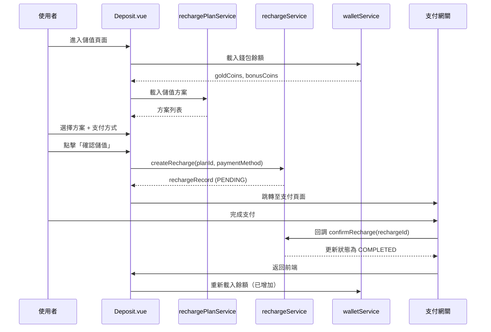

# 儲值功能實作文件

## 📝 實作日期
2026-02-08

---

## 🎯 功能概述

完整實作前端儲值功能，包含：
1. ✅ 顯示儲值方案列表（從 API 載入）
2. ✅ 顯示當前金幣/紅利餘額
3. ✅ 選擇儲值方案
4. ✅ 選擇支付方式（ECPAY/OPAY/CREDIT_CARD）
5. ✅ 建立儲值請求
6. ✅ 支付成功/失敗回調處理

---

## 📦 新增檔案

### 1. `src/services/rechargeService.ts`

**功能**：處理儲值相關的 API 呼叫

**提供的函數**：
- `createRecharge(payload)` — 建立儲值請求
- `confirmRecharge(rechargeId, transactionId?)` — 確認支付成功
- `failRecharge(rechargeId, failReason?)` — 記錄支付失敗

**API 端點**：
- `POST /api/recharge` — 建立儲值
- `POST /api/recharge/{rechargeId}/confirm` — 確認支付
- `POST /api/recharge/{rechargeId}/failure` — 標記失敗

**使用範例**：
```typescript
import { createRecharge, confirmRecharge } from '@/services/rechargeService';

// 1. 建立儲值請求
const response = await createRecharge({
  planId: 'plan-uuid',
  paymentMethod: 'ECPAY',
  remark: '測試儲值'  // 選填
});

// 2. 確認支付（由支付網關回調或前端確認）
await confirmRecharge(response.data.id, 'transaction-id-from-gateway');
```

---

## ♻️ 更新檔案

### 1. `src/views/member/Deposit.vue`

**變更內容**：
- ❌ 移除舊的「自訂金額」UI
- ❌ 移除固定金額按鈕（200/500/1000...）
- ✅ 新增儲值方案卡片 UI
- ✅ 整合 `rechargePlanService` 載入方案列表
- ✅ 整合 `rechargeService` 建立儲值請求
- ✅ 顯示當前金幣/紅利餘額（從 wallet API）
- ✅ 支付方式改為 ECPAY/OPAY/CREDIT_CARD

**UI 變更對照**：

**舊版（硬編碼金額）**：
```
[ 200 ] [ 500 ] [ 1000 ] [ 2000 ] [ 5000 ]
或自訂金額：________
```

**新版（動態方案卡片）**：
```
┌─────────────┐  ┌─────────────┐  ┌─────────────┐
│ 送 50      │  │ 送 200      │  │ 送 500      │
│ NT$ 500    │  │ NT$ 1000    │  │ NT$ 2000    │
│ 基礎方案    │  │ 超值方案    │  │ 豪華方案    │
│ 實得: 550  │  │ 實得: 1200  │  │ 實得: 2500  │
└─────────────┘  └─────────────┘  └─────────────┘
```

---

## 🔧 技術細節

### 資料流程



---

## 📋 API 對應

### Recharge Plan API (儲值方案)

```typescript
// GET /api/recharge-plan/list
{
  "success": true,
  "data": [
    {
      "id": "plan-uuid",
      "name": "超值方案",
      "amount": 1000,          // 儲值金額（台幣）
      "bonus": 100,            // 贈送紅利
      "totalValue": 1100,      // 實得金幣
      "description": "儲值 1000 送 100",
      "status": "ACTIVE"
    }
  ]
}
```

### Recharge API (儲值請求)

```typescript
// POST /api/recharge
Request:
{
  "planId": "plan-uuid",
  "paymentMethod": "ECPAY",      // ECPAY | OPAY | CREDIT_CARD
  "remark": "測試儲值"           // 選填
}

Response:
{
  "success": true,
  "data": {
    "id": "recharge-uuid",
    "planId": "plan-uuid",
    "amount": 1000,
    "goldCoins": 1000,           // 獲得金幣
    "bonusCoins": 100,           // 獲得紅利
    "paymentMethod": "ECPAY",
    "paymentStatus": "PENDING",  // PENDING | COMPLETED | FAILED
    "createdAt": "2026-02-08T10:30:00Z"
  }
}
```

---

## 🎨 UI 元件說明

### 儲值方案卡片 (`deposit__plan-card`)

**狀態**：
- **普通狀態**：灰色邊框
- **懸停狀態**：邊框變深色，向上位移 2px
- **選中狀態**：橘色邊框（3px），背景變為淡黃色

**徽章**（bonus > 0 時顯示）：
- 位置：右上角
- 內容：「送 {bonus}」
- 顏色：橘色漸層 + 白色文字

---

## 🧪 測試檢查清單

### 功能測試
- [ ] 進入頁面自動載入錢包餘額
- [ ] 進入頁面自動載入儲值方案列表
- [ ] 點擊方案卡片可正確選中（橘色邊框）
- [ ] 未選擇方案時點擊「確認儲值」會提示
- [ ] 選擇方案後顯示確認對話框
- [ ] 確認後建立儲值請求成功
- [ ] 儲值成功後餘額更新

### UI 測試
- [ ] 方案卡片在不同螢幕尺寸正確顯示（響應式）
- [ ] 有 bonus 的方案顯示徽章
- [ ] 選中方案的視覺回饋明確
- [ ] 載入狀態顯示「載入儲值方案中...」

### 錯誤處理
- [ ] API 失敗時顯示錯誤提示
- [ ] 無儲值方案時顯示「目前沒有可用的儲值方案」
- [ ] 網路錯誤時有適當提示

---

## 🚀 後續優化建議

### 1. 支付網關整合
目前實作為 Demo 版本，實際上線前需要：
- 整合綠界支付（ECPAY）SDK
- 整合歐付寶（OPAY）SDK
- 實作支付表單跳轉邏輯
- 實作支付回調頁面

### 2. 支付狀態追蹤
建議新增：
- 儲值記錄列表頁面（`/member-center/recharge-history`）
- 支付狀態即時查詢
- 支付失敗重試機制

### 3. 方案推薦邏輯
可以新增：
- 「最划算」標籤（bonus 比例最高）
- 「熱門」標籤（購買次數最多）
- 推薦方案置頂

---

## 📄 相關檔案

### Services
- `src/services/rechargeService.ts` — 儲值 API（新建）
- `src/services/rechargePlanService.ts` — 儲值方案 API（已存在）
- `src/services/walletService.ts` — 錢包 API

### Views
- `src/views/member/Deposit.vue` — 儲值頁面（已更新）

### Utils
- `src/utils/executeApiUtils.ts` — API 執行包裝器
- `src/utils/dialog/ichibanInfoDialog.ts` — 提示對話框
- `src/utils/dialog/ichibanConfirmDialog.ts` — 確認對話框

---

## 💡 開發筆記

### PaymentMethod 類型變更
- 舊版：`'CREDIT_CARD' | 'ATM' | 'CVS'`
- 新版：`'ECPAY' | 'OPAY' | 'CREDIT_CARD'`
- 原因：對應後端 API 實際支援的支付方式

### Wallet 欄位名稱
- 使用 `goldCoins` 和 `bonusCoins`（新版）
- 不再使用 `balance` 和 `bonus`（舊版已廢棄）

### 方案資料映射
確保從 API 取得的資料正確映射到前端型別：
```typescript
{
  id: p.id || '',
  name: p.name || '',
  amount: Number(p.amount ?? 0),
  bonus: Number(p.bonus ?? 0),
  totalValue: Number(p.totalValue ?? p.amount ?? 0),
  description: p.description || '',
  status: p.status || 'ACTIVE',
}
```

---

## ✅ 實作完成度

- ✅ 儲值方案載入
- ✅ 錢包餘額顯示
- ✅ 方案選擇 UI
- ✅ 支付方式選擇
- ✅ 建立儲值請求
- ✅ 錯誤處理
- ✅ 響應式設計
- ⏳ 支付網關整合（待後端提供支付 URL）
- ⏳ 支付回調處理（待後端實作）
- ⏳ 儲值記錄頁面（規劃中）
